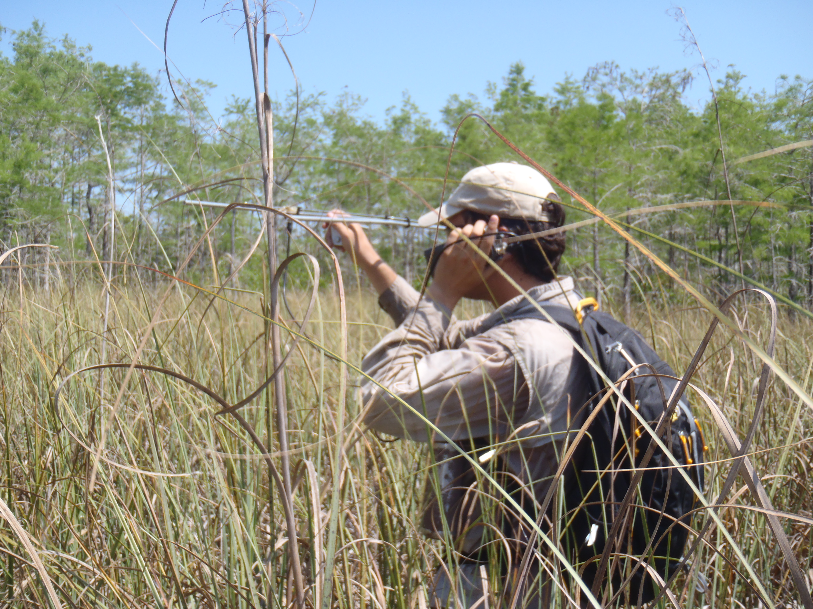
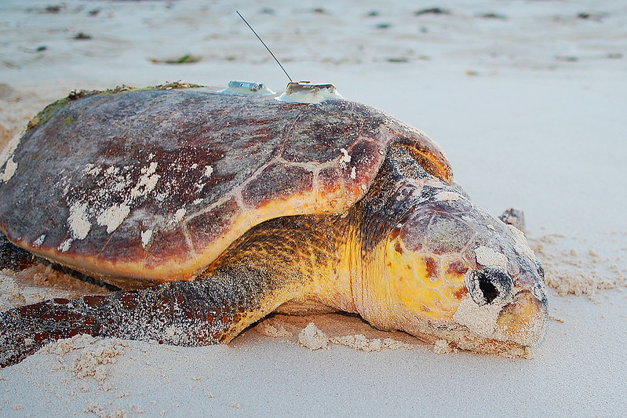

```{r setup}
#| include: false
library(tidyverse)

knitr::opts_knit$set(
  root.dir = here::here("02 Other Data/")
)

knitr::opts_chunk$set(
  echo = TRUE,
  warning = FALSE,
  message = FALSE,
  fig.height = 4.5,
  fig.width = 4.5
)
```


## Lagrangian vs. Eulerian Data

- Animal movement can be tracked from two perspectives: 
  - Individual (**Lagrangian**)
  - Population (**Eulerian**)
- The names of these perspectives come from the study of fluid dynamics.
- During this workshop, we focus on the **Lagrangian** perspective.
  - GPS tracking provides cheap, precise individual tracking.
  - Other data sources are more popular in other systems.
  
## Other Sources of Lagrangian Data

- VHF radio telemetry
- Argos satellite telemetry
- Acoustic telemetry
  - Active
  - Passive
- Others
  - Light-level Geolocation
  - PIT tag telemetry
  - [Motus](https://motus.org){target="blank"} telemetry system
  - [ICARUS](https://www.icarus.mpg.de/en){target="blank"} telemetry system

# VHF Radio Telemetry

## VHF Radio Telemetry

:::: {.columns}

::: {.column width="45%"}

</br>

- **V**ery **H**igh **F**requency radio waves (30 - 300 MHz)
- Locations obtained by:
  - Triangulation
  - Homing
- Automated systems available to record locations
- Hardware can be smaller and lighter than GPS units

:::

::: {.column width="5%"}

:::

::: {.column width="45%"}

\

:::

::::

## VHF Radio Telemetry

:::: {.columns}

::: {.column width="45%"}

</br>

- Manual tracking often restricts frequency of relocations and number of individuals.
- Automatic tracking systems come with high up-front cost.
  - But often have very high temporal resolution.
- Potential location errors/imprecision due to environmental conditions or user error.
  - Errors in triangulation bearing scale up to errors in location estimate.

:::

::: {.column width="5%"}

:::

::: {.column width="45%"}

\

:::

::::

# Argos Satellite Telemetry

## Argos Satellite Telemetry

:::: {.columns}

::: {.column width="45%"}

- [Argos system](https://en.wikipedia.org/wiki/Argos_(satellite_system)){target="blank"} was established in a collaboration between the US and France in 1978.
- Currently run by CLS, a French company created in 1986 to commercialize the system.
- Tags are known as platform transmitter terminals (PTTs).


:::

::: {.column width="5%"}

:::

::: {.column width="45%"}

\

:::

::::

## Argos Satellite Telemetry

:::: {.columns}

::: {.column width="45%"}

- Locations are estimated from the Doppler shift on the signals when they are received by the satellites.
  - Satellites are in a circumpolar orbit.
  - Location estimates are less precise than GPS (within kilometers).
  - Location error polygons are well studied (more on this in *Module 5*).

:::

::: {.column width="5%"}

:::

::: {.column width="45%"}

\

:::

::::

## Argos Satellite Telemetry

:::: {.columns}

::: {.column width="45%"}


- Satellites transmit data to receiving stations for processing.
  - Data are available without recovering the tag.
  - Satellites are also capable of receiving additional data from the tag, e.g., GPS locations.

:::

::: {.column width="5%"}

:::

::: {.column width="45%"}

\

:::

::::

# Acoustic Telemetry

## Acoustic Telemetry

:::: {.columns}

::: {.column width="45%"}


- Radio signals do not propagate in salt water, so most marine underwater tracking is done via acoustic telemetry.
  - Also a popular technology for aquatic tracking.
- Acoustic tags transmit a unique ID, which is recorded by one or more receivers.
  - Receivers may be anchored in place (passive tracking).
  - Receivers may be handheld or attached to a vessel (active tracking).

:::

::: {.column width="5%"}

:::

::: {.column width="45%"}

{.lightbox}\

[Smith et al. (2019)](https://doi.org/10.1186/s40317-019-0177-3){target="blank"}

:::

::::

## Acoustic Telemetry

:::: {.columns}

::: {.column width="45%"}


- Active tracking is similar to manual VHF radio tracking in that data collection is limited by personnel time and skill.
- Much larger datasets are collected by collaborative networks that share data from passive acoustic receivers.
  - [GLATOS](https://glatos.org/){target="blank"}, Great Lakes Acoustic Telemetry Observation System
  - [FACT array](https://myfwc.com/research/saltwater/telemetry/fact/){target="blank"}, Florida Atlantic Coast Telemetry array
  - [IMOS](https://imos.org.au/){target="blank"}, Integrated Marine Observing System in Australia
  - [ATAP](https://saiab.ac.za/platforms/acoustic-tracking-array-platform/){target="blank"}, Acoustic Tracking Array Platform in South Africa
  - [ETN](https://europeantrackingnetwork.org/en){target="blank"}, European Tracking Network

:::

::: {.column width="5%"}

:::

::: {.column width="45%"}

{.lightbox}\

:::

::::

# Handling Lagrangian Data

## Handling Lagrangian Data {.smaller}


:::: {.columns}

::: {.column width="45%"}

### High Precision

If the **precision** of the location estimates is **high** *relative* to the spatial scale of the process and questions, treat the data like GPS data (*focus of this course*).

- Some preprocessing to remove clearly imprecise locations.
  - Module 5.
- Examples:
  - VHF data based on homing or careful triangulation.
  - Argos data for large-bodied species and coarse scale processes.
  - Passive acoustic data from a dense array.

:::

::: {.column width="5%"}

:::

::: {.column width="45%"}

### Low Precision

If the **precision** of the location estimates is **low** *relative* to the spatial scale of the process and questions, propagating uncertainty is probably critical to any analysis.

- Treat the data as a noisy sample from a latent location variable.
- Model movement with a state-space (hierarchical) model.
- Examples:
  - Most Argos data with variable location classes (quality estimates).
  - Sparse passive acoustic detections on single receivers.
  - Geolocator data.
- R packages available for fitting SSMs:
  - [`aniMotum`](https://ianjonsen.github.io/aniMotum/){target="blank"}, using Template Model Builder.
  - [`bsam`](https://github.com/ianjonsen/bsam){target="blank"}, using JAGS.

:::

::::

# Questions?
