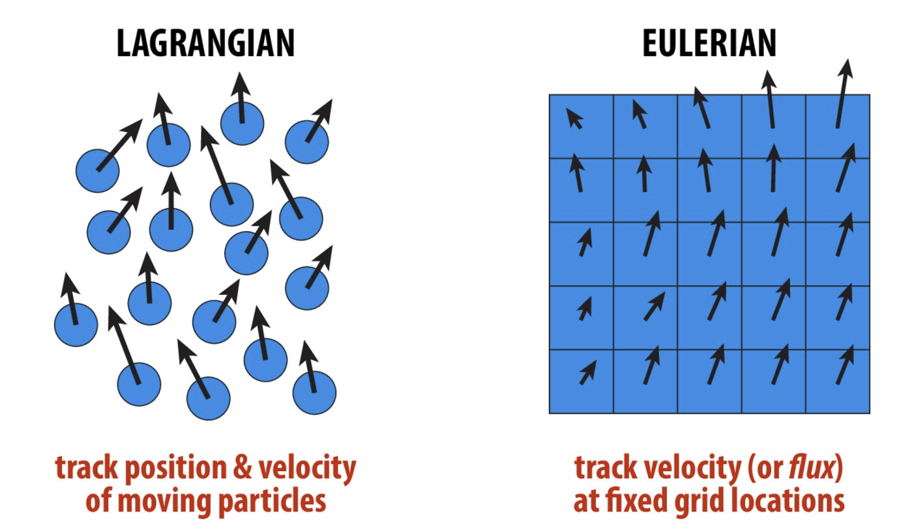
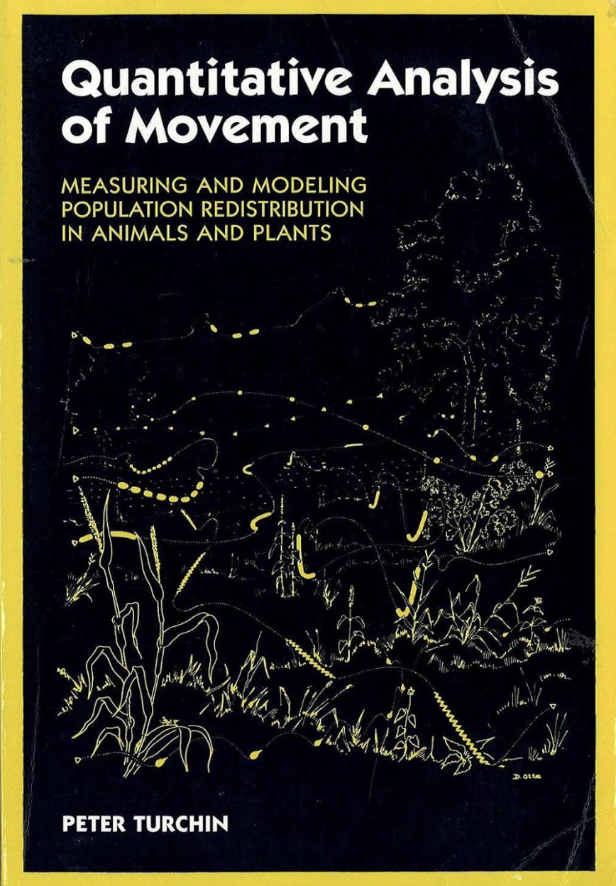

```{r setup}
#| include: false
library(tidyverse)

knitr::opts_knit$set(
  root.dir = here::here("03 Steps and Turns/")
)

knitr::opts_chunk$set(
  echo = TRUE,
  warning = FALSE,
  message = FALSE,
  fig.height = 4.5,
  fig.width = 4.5
)
```


## Goal

- How to represent movement of an animal
- From points to steps
- Annotate steps
- Example

## Eulerian vs Lagrangian view

- **Lagrangian**: tracking individual animals (e.g., with GPS collars). Study at the individual level.
- **Eulerian**: tracking animals from fixed points (e.g., with camera traps). Study at the population level.

{fig-cap="Source: https://15462.courses.cs.cmu.edu/fall2018/lecture/pdes/slide_023" width="90%"}

Source: <https://15462.courses.cs.cmu.edu/fall2018/lecture/pdes/slide_023>

## Path, move, steps

:::: {.columns}
    
::: {.column width="70%"}
- **Path**: continuous trace of an animal moving through space from the beginning to the end of observation.
- **Move**: Each path is represented as a series of straight-line moves. Each move is defined as the displacement between two consecutive stopping points. 
- **Steps**: Breakpoints of a path at regular time intervals.
:::

::: {.column width="30%"}




:::
::::

  
  

## Movement characteristics 

Tracks are still *just* the points as they were collected. If we want to get insights, we have can look at different characteristics of steps (i.e., two consecutive relocations). 

This include: 

- step length (`sl_`)
- turn angle (`ta_`)
- speed
- Net squared displacement

::: {.callout-note .fragment}
Note, unless you take care of different instances or bursts, they are ignored. 
:::

## Steps

We can start to create a `steps`-representation.

```{r}
#| echo: false
#| out.width: 20%
knitr::include_graphics(here::here("03 Steps and Turns/img/steps.png"))
```

This can be achieved with the function `amt::steps()`. If we resampled the data previously, we can even use `amt::steps_by_burst()`. 

----

### Example

A simple example with 9 simulated data points. 

:::: {.columns}
::: {.column width="60%"}


```{r, echo = FALSE}
trk <- tibble(
  x = c(0, 0, 1, 1.5, 2, 2, 3, 4, 3, 4, 5), 
  y = c(0, 1, 1, 1.5, 2, 3, 2, 1, 3, 2, 3),
  t = now() + hours(0:10), 
  burst_ = c(1, 1, 1, 1, 2, 2, 2, 2, 2, 3, 3)
)

ggplot(trk, aes(x, y)) + 
  theme_minimal() +
  geom_hline(yintercept = 0, lty = 2, col = "red") +
  geom_point(size = 3, alpha = 0.4, col = "blue")
```

:::
::: {.column width="40%"}

```{r}
#| eval: false
trk <- make_track(dat, x, t, y)
```

:::
::::

----------

### ... continued ...

Creating steps, but ignoring bursts.

:::: {.columns}
::: {.column width="60%"}


```{r, echo = FALSE}
ggplot(trk, aes(x, y)) + 
  geom_hline(yintercept = 0, lty = 2, col = "red") +
  geom_point(size = 3, alpha = 0.4, col = "blue") +
  theme_minimal() +
  geom_path(arrow = arrow(length = unit(0.55, "cm")))
```

:::
::: {.column width="40%"}

```{r}
#| eval: false
trk <- make_track(dat, x, t, y)
trk |> steps()
```

:::
::::

----------

### ... continued ...

Respecting bursts when creating steps: 

:::: {.columns}
::: {.column width="60%"}


```{r, echo = FALSE}
library(lubridate)
trk <- tibble(
  x = c(0, 0, 1, 1.5, 2, 2, 3, 4, 3, 4, 5), 
  y = c(0, 1, 1, 1.5, 2, 3, 2, 1, 3, 2, 3),
  t = now() + hours(0:10), 
  burst_ = c(1, 1, 1, 1, 2, 2, 2, 2, 2, 3, 3)
)

ggplot(trk, aes(x, y, group = burst_, col = factor(burst_))) + 
  geom_point(size = 3, alpha = 0.4, col = "blue") +
  geom_path(arrow = arrow(length = unit(0.55, "cm"))) +
  theme_minimal() +
  labs(col = "burst_")
``` 

:::
::: {.column width="40%"}

```{r}
#| eval: false
trk <- make_track(dat, x, t, y)
trk |> track_resample() |> 
  steps_by_burst()
```

:::
::::

----------

### ... continued ...


Retaining only bursts with a minimum number of points. 


:::: {.columns}
::: {.column width="60%"}


```{r, echo = FALSE}
library(lubridate)
trk <- tibble(
  x = c(0, 0, 1, 1.5, 2, 2, 3, 4, 3, 4, 5), 
  y = c(0, 1, 1, 1.5, 2, 3, 2, 1, 3, 2, 3),
  t = now() + hours(0:10), 
  burst_ = c(1, 1, 1, 1, 2, 2, 2, 2, 2, 3, 3)
)

ggplot(trk, aes(x, y, group = burst_, col = factor(burst_))) + 
  geom_point(size = 3, alpha = 0.4) +
  geom_path(arrow = arrow(length = unit(0.55, "cm")), 
            data = trk |> filter(burst_ != 3)) +
  theme_minimal() +
  labs(col = "burst_")
``` 

:::
::: {.column width="40%"}

```{r}
#| eval: false
trk <- make_track(dat, x, t, y)
trk |> track_resample() |> 
  filter_min_n_burst() |> 
  steps_by_burst()
```

:::
::::

-----

### Output of `steps()` 

:::: {.columns}
::: {.column width="50%"}

This automatically calculates several step attributes: 

- Start and end point
- Step length
- Absolute and relative turn angles
- Duration

:::
::: {.column width="50%" .fragment}

```{r}
library(amt)
data("deer")
deer |> steps_by_burst() |> 
  glimpse(width = 45)
```


:::
::::

# Annotating steps

## Extract covariates

- Movement data are much more powerful if connected with other covariates in space and time. 
- The function `extract_covariates()` is a generic function to extract covariate values from rasters for a track and/or steps. 


::: {.callout-tip .fragment}
### Vector data
The function `extract_covariates()` is designed to work with raster data. If you have vector data that you want to use to annote your tracking data, its easiert to rasterize it first, e.g., with `terra::rasterize()`.
:::

:::: {.columns}

::: {.column width = "50%"}
:::

::: {.column width = "50%" .fragment}
:::

::::

::: {.notes}
- Explain what I mean with generic, i.e., same function for different objects
:::

----

A very simple example:

:::: {.columns}

::: {.column width = "33%"}


```{r}
#| echo: false
dat <- tibble(x = c(0.5, 1.5), y = 1.5)
trk <- make_track(dat, x, y)
r <- terra::rast(xmin = 0, xmax = 2, ymin = 0, ymax = 2, res = 1)
terra::values(r) <- 1:4
terra::plot(r)
points(trk, pch = 20, cex = 2, col = "red")
arrows(0.5, 1.5, 1.5, 1.5)
```

<div style="font-size: 0.7em;">
::: {.callout-tip .fragment data-fragment-index="3"}
To have meaningful names of the covariate rename the raster layer with `names(r) <- c("name")`. 
:::

</div>

:::

::: {.column width = "33%" .fragment data-fragment-index="1"}

<div style="font-size: 0.7em;">

```{r}
extract_covariates(trk, r) |> 
  glimpse()
steps(trk) |> 
  extract_covariates(r) |> 
  glimpse()
steps(trk) |> 
  extract_covariates(r, where = "start") |> 
  glimpse()
```

</div>
:::
::: {.column width = "33%" .fragment data-fragment-index="2"}

<div style="font-size: 0.7em;">

```{r}
steps(trk) |> 
  extract_covariates(r, where = "end") |> 
  glimpse()
steps(trk) |> 
  extract_covariates(r, where = "both") |> 
  glimpse()
```

</div>

:::
::::


## Time of the day


- Tracks and steps can be annotated with the time of day using the function `time_of_day()`. This will add additional columns to the data frame of steps called `tod_end` or `tod_start` depending on the argument `when`.
- If the data is of sufficient temporal resolution, it is also possible to annotate twilight (dawn and dusk). 

- Time of day are determined using the package `suncalc`. 


# Example

## Moll et al. 2021

Remington Moll observed a (rare) long distance dispersal for White Tail deer^[Moll et. al Ecology and Evolution; <https://onlinelibrary.wiley.com/doi/full/10.1002/ece3.7354.>] and looked at the turn angle and step distribution for day and night. 

```{r}
#| echo: false
knitr::include_graphics("img/moll3_part.jpg")
```

---------

:::: {.columns}

::: {.column width = "50%"}
```{r}
#| echo: false
knitr::include_graphics("img/moll3_part.jpg")
```
:::

::: {.column width = "50%"}

::: {.callout-tip}
### Speed
Moll et al. (2021) use speed (velocity) instead of step length here. Speed is just the step length for a given time interval.
:::

::::


:::: {.columns}

::: {.column width = "50%"}

Pair up into groups of 3 - 4 people and discuss:

- During dispersal, how do you expect the animal to move during the day?
- How does movement differ between day an night?

:::

::: {.column width = "50%"}

::: {style="display:flex; justify-content:center; align-items:center; height:100%;"}

:::{.timer #timer-2 seconds=240 starton=interaction}
:::

:::

:::

::::

::: {.notes}
- Explain what I mean with generic, i.e., same function for different objects
:::
