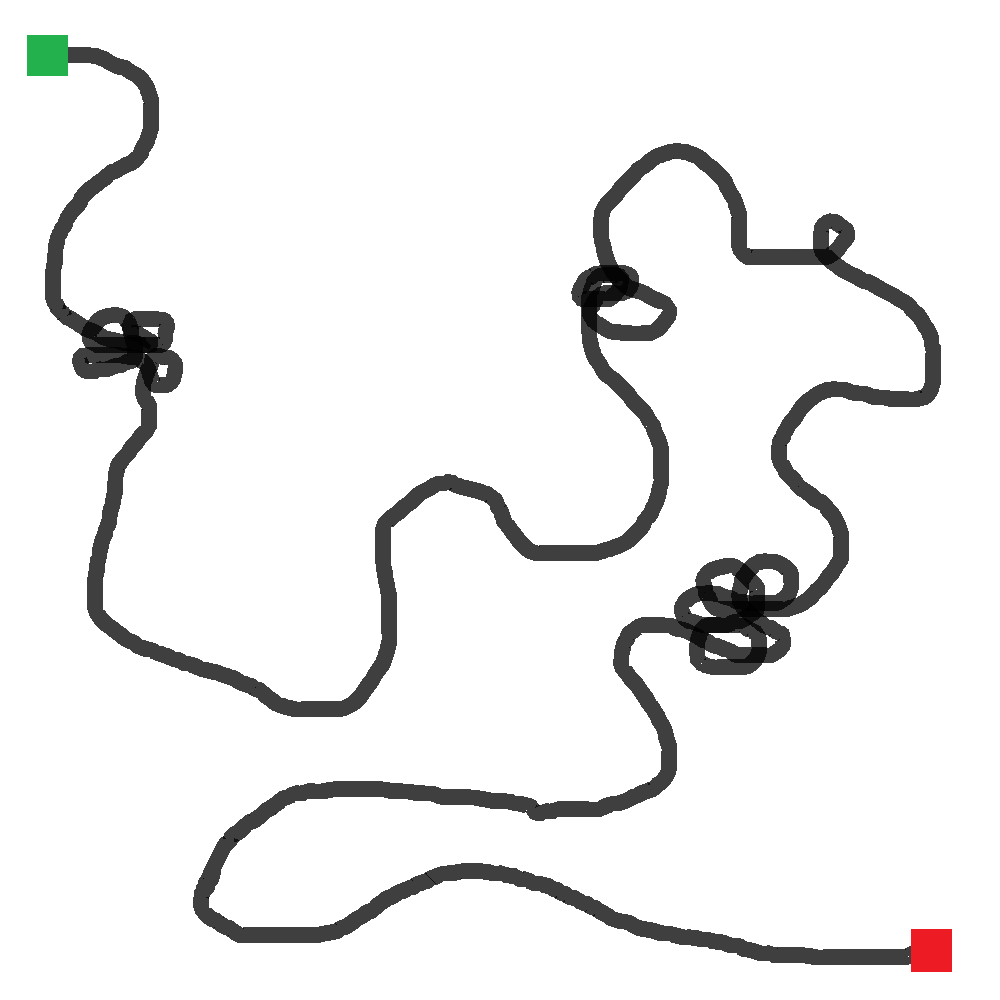
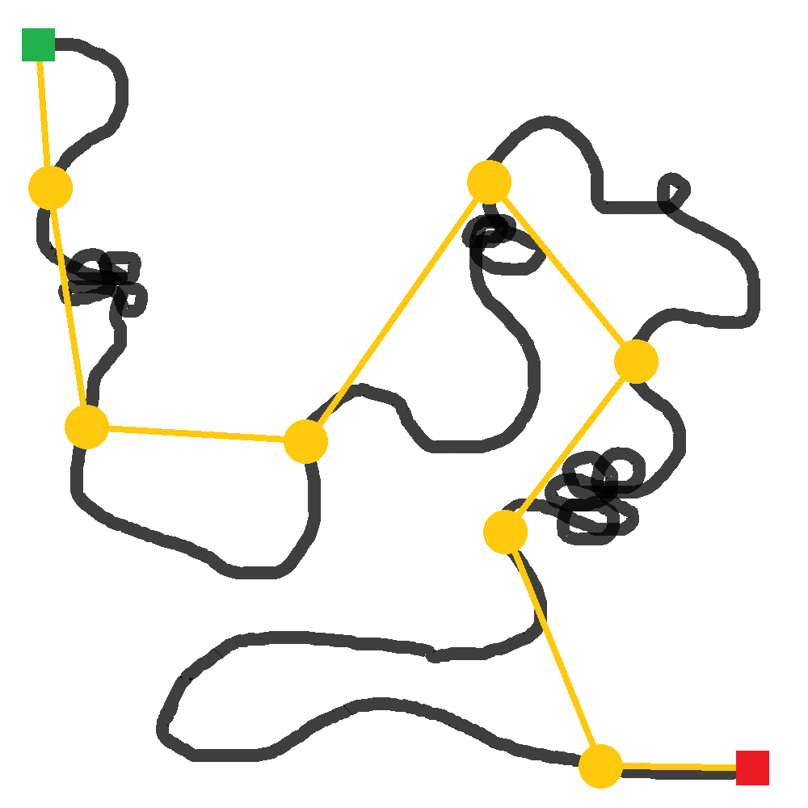
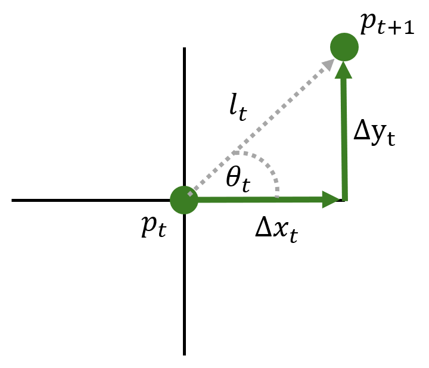
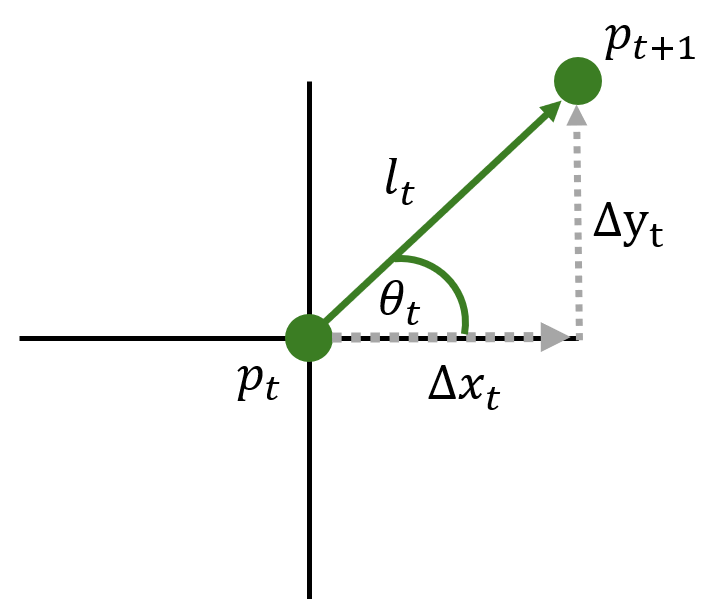

```{r setup}
#| include: false
library(tidyverse)
library(RefManageR)
library(amt)
library(terra)

knitr::opts_knit$set(
  root.dir = here::here("04 Random Walks/")
)

knitr::opts_chunk$set(
  echo = TRUE,
  warning = FALSE,
  message = FALSE,
  fig.height = 4.5,
  fig.width = 4.5
)

options(htmltools.dir.version = FALSE)
BibOptions(check.entries = FALSE, bib.style = "authoryear", style = "markdown",
           dashed = TRUE, hyperlink = "to.doc")
bib <- ReadBib(here::here("04 Random Walks/", "04_refs.bib"))
```

# Continuous vs. Discrete Time ⌚ 

## Continuous vs. Discrete Time 

:::: {.columns}

::: {.column}

> "Moving animals trace continuous paths through space. However, in order to record and analyze the pattern of their movement the essential characteristics of an observed path have to be represented in a discrete form suitable for computer storage and analysis... Note that this empirical approach to representing paths fits well with the theoretical framework of discrete random walks."

— Turchin 1998, p. 128

:::

::: {.column}

{height="600"}\

:::

::::


## Continuous vs. Discrete Time

:::: {.columns}

::: {.column}

> "The discrete-time context is valuable because (1) a wealth of tools can be borrowed from the time series literature, (2) the dynamics are easily conceptualized in discrete time, and finally, (3) we are implementing models digitally on computers, thus we must discretize ... One could argue, however, that the true process of movement really occurs in both continuous time and continuous space."

— Hooten et al. 2017, p. 189

:::

::: {.column}

{height="600"}\

:::

::::

##

<center>



</center>

##

<center>



</center>

## Continuous vs. Discrete Time


:::: {.columns}

::: {.column}

### Why Discrete Time?

- Animal movement is observed at discrete intervals.
- Step lengths and turn angles drawn from stochastic distributions at discrete times are intuitive to understand.
  - Fitted parameters are also easier to understand.
- Makes latent behavioral states easier to estimate.

:::

::: {.column}

### Why Continuous Time?

- Animals actually move in continuous time.
- Handles data collected at irregular times.
  - Discrete-time analyses are not timescale-invariant.
- Computationally fast approximations are available. 
  - (but not for >2 latent behavioral states)

:::

::::

<span style = "color:#909090; font-size:80%;">*For a more detailed comparison, see McClintock et al. (2014).*</span>


# Classifying Random Walks

## Classifying Random Walks

Random walks (in discrete or continuous time) can be classified depending on whether or not they include correlation or bias:

- Simple (pure) random walk (**RW**)
- Correlated random walk (**CRW**)
- Biased random walk (**BRW**)
- Biased correlated random walk (**BCRW**)

# Discrete Time Random Walks

## Simple Random Walk (RW)

:::: {.columns}

::: {.column width="40%"}

- **Positions** are generated by a first-order Markov process.
  - Next position $(t+1)$ depends only on current position $(t)$.
- **Steps** are non-Markovian.
  - Each step is independent.
- Approximates Brownian motion.
  - See Codling et al. (2008).

:::


::: {.column width="60%"}

```{r}
#| echo: false
#| fig-width: 7
#| fig-height: 5

set.seed(123456)
start <- data.frame(x = 0, y = 0)
rw1 <- data.frame(x1_ = start$x,
                  y1_ = start$y,
                  x2_ = rnorm(n = 15),
                  y2_ = rnorm(n = 15))

ggplot() +
  geom_segment(data = rw1, aes(x = x1_, y = y1_, xend = x2_, yend = y2_),
               arrow = arrow(length = unit(0.1, "inches"), type = "closed"),
               linetype = "dashed") +
  geom_point(data = start, aes(x = x, y = y), size = 5) +
  coord_equal() +
  xlab("X-coordinate") +
  ylab("Y-coordinate") +
  theme_minimal()


```

:::

::::

## Simple Random Walk (RW)

### From a point representation


:::: {.columns}

::: {.column}

Calculated

$$p_t = \{x_t, y_t\}$$
$$p_{t+1} = \{x_t + \Delta x_t, y_t + \Delta x_t\}$$

Random

$$\Delta x_t \sim Normal(0, \sigma_x^2)$$
$$\Delta y_t \sim Normal(0, \sigma_y^2)$$

:::


::: {.column}

{.lightbox}\

:::

::::

## Simple Random Walk (RW)

### From a step representation


:::: {.columns}

::: {.column}

Random 

$$l_t \sim gamma(\alpha, \beta)$$
$$\theta_t \sim von Mises(\mu, \kappa)$$

Calculated

$$\Delta x_t = l_t \cos(\theta_t)$$
$$\Delta y_t = l_t \sin(\theta_t)$$

:::


::: {.column}

{.lightbox}\

:::

::::

## Correlated Random Walk (CRW)

:::: {.columns}

::: {.column width="40%"}

- **Positions** are generated by a second-order Markov process.
  - Next position $(t+1)$ depends on current position $(t)$ *and* previous position $(t-1)$.
- **Steps** are generated by a first-order Markov process.
  - Each step is correlated with the previous step.

:::


::: {.column width="60%"}

```{r}
#| echo: false
#| fig-width: 7
#| fig-height: 7

set.seed(1234567)
start <- data.frame(x = c(-0.75, 0, 1), y = c(-1, 0, 0.75)) %>% 
  make_track(x, y) %>% 
  steps()

rsteps <- random_steps(start, n_control = 15,
                       sl_distr = make_gamma_distr(shape = 2, scale = 0.5),
                       ta_distr = make_vonmises_distr(kappa = 2.0))

ggplot() +
  geom_segment(data = rsteps, aes(x = x1_, y = y1_, xend = x2_, yend = y2_),
               arrow = arrow(length = unit(0.1, "inches"), type = "closed"),
               linetype = "dashed") +
  geom_segment(data = start[1,], aes(x = x1_, y = y1_, xend = x2_, yend = y2_),
               arrow = arrow(length = unit(0.1, "inches"), type = "closed"),
               linetype = "solid", linewidth = 1.5) +
  geom_point(data = start, aes(x = x1_, y = y1_), size = 5) +
  coord_equal() +
  xlab("X-coordinate") +
  ylab("Y-coordinate") +
  theme_minimal()


```

:::

::::

## Correlated Simple Random Walk (RW)

### Use a step representation


:::: {.columns}

::: {.column width="40%"}

Random 

$$l_t \sim gamma(\alpha, \beta)$$
$$\Delta\theta_t \sim von Mises(\mu, \kappa)$$

Calculated

$$\theta_t = \theta_{t-1} + \Delta \theta_t$$

:::


::: {.column width="60%"}

{.lightbox height=600}\

:::

::::

## Biased Random Walk (BRW)

:::: {.columns}

::: {.column width="40%"}

- **Positions** are generated by a first-order Markov process.
  - Next position $(t+1)$ depends only on current position $(t)$.
- **Steps** are non-Markovian.
  - Each step is independent.
- Some preferred heading.
  - Bias can be local or global.

:::


::: {.column width="60%"}

```{r}
#| echo: false
#| fig-width: 7
#| fig-height: 5

set.seed(12345678)
start <- data.frame(x = 0, y = 0)
rw1 <- data.frame(x1_ = start$x,
                  y1_ = start$y,
                  x2_ = rnorm(n = 15, mean = 1, sd = 0.5),
                  y2_ = rnorm(n = 15, mean = 0, sd = 0.5))

ggplot() +
  geom_segment(data = rw1, aes(x = x1_, y = y1_, xend = x2_, yend = y2_),
               arrow = arrow(length = unit(0.1, "inches"), type = "closed"),
               linetype = "dashed") +
  geom_point(data = start, aes(x = x, y = y), size = 5) +
  coord_equal() +
  xlab("X-coordinate") +
  ylab("Y-coordinate") +
  theme_minimal()


```

:::

::::

## Biased Random Walk (BRW)

:::: {.columns}

::: {.column}

### Local Bias

- Attraction to a place (or places)
- Heading changes with position

{.lightbox}\

:::

::: {.column}

### Global Bias

- Attraction to a heading
- Equivalent to attraction to a place infinitely far away

{.lightbox}\

:::

::::

## Biased Correlated Random Walk (BCRW)

- Includes both bias and correlation
- Often how we conceive actual animal movement tracks

```{r}
#| echo: false
#| fig-align: center
#| fig-width: 10

box <- ext(round(c(min(deer$x_) - 500,
             max(deer$x_) + 500,
             min(deer$y_) - 500,
             max(deer$y_) + 500)))

sh_forest <- get_sh_forest() %>% 
  crop(box) %>% 
  as.data.frame(xy = TRUE)

deer_stp <- deer %>% 
  steps_by_burst()

ggplot() +
  geom_raster(data = sh_forest, aes(x = x, y = y, fill = factor(forest, 
                                                                levels = c(1, 0),
                                                                labels = c("Forest", "Other")))) +
  geom_segment(data = deer_stp, aes(x = x1_, y = y1_, xend = x2_, yend = y2_)) +
  coord_equal(expand = FALSE) +
  scale_fill_manual(name = "Land Cover", values = c("forestgreen", "wheat")) +
  xlab("X-coordinate") +
  ylab("Y-coordinate") +
  theme_minimal()

```

## Take-home Messages {background-color="#0c4869"}

</br>

- Random walks can be:
  - Simple
  - Correlated
  - Biased
  - Biased & correlated
  
- Discrete time random walks can be formulated as a model of **points** or **steps**, but it's usually easier to formulate them as **steps**.


# Continuous Time Random Walks

## Continuous Time Random Walk Models

</br>

- Continuous time random walks are expressed as differential equations.
  - We won't cover the equations here, just the properties of the models.
- Like discrete time models can model points or steps, continuous time models can be specified in terms of position or velocity.
- *We will cover the models presented by Fleming et al. (2014).*

## Brownian Motion

</br>

:::: {.columns}

::: {.column width="60%"}

- Pure random walk in continuous time.
- Constant **diffusion** rate.
- Named for [Robert Brown](https://en.wikipedia.org/wiki/Robert_Brown_(botanist,_born_1773)), who described the motion of pollen grains in water.
  - Inspired Einstein to model this system as the pollen grain being moved by individual water molecules.
  - [His work on Brownian motion](https://en.wikipedia.org/wiki/%C3%9Cber_die_von_der_molekularkinetischen_Theorie_der_W%C3%A4rme_geforderte_Bewegung_von_in_ruhenden_Fl%C3%BCssigkeiten_suspendierten_Teilchen) provided support for the existence of atoms.

:::


::: {.column width="10%"}

:::

::: {.column width="30%"}

{width="100%"}\

:::

::::

## Anomalous Diffusion

- Generalizes Brownian motion
  + Still not **CRW** or **BRW**
- Power-law diffusion
- Extra parameter, $\alpha$
  + $\alpha < 1 \Rightarrow$ subdiffusion
  + $\alpha = 1 \Rightarrow$ diffusion (Brownian motion)
  + $\alpha > 1 \Rightarrow$ superdiffusion (ballistic motion)
  
## Brownian and Anomalous Diffusion

<center>

{width=683 height=522}\

</center>

::: {style="font-size: 60%;"}

[Wikipedia](https://en.wikipedia.org/wiki/Anomalous_diffusion){target="blank"}

:::

## Ornstein-Uhlenbeck Process

- Restricted **BM** with central attractor
  - "Mean-reverting" process
  - *I.e.*, attraction to a mean **position** (see below)
- Often interpreted as foraging within a home range
  - Attractor is the center of the home range
- **BRW**

*Note*
- An OU process in terms of velocity (attraction to a mean velocity) was used by Johnson et al. (2008) to parameterize a **CRW**


## Ornstein-Uhlenbeck Process with Foraging (OUF)

- OU model with foraging
  - Newly developed by Fleming et al. (2014) to improve model fit with real data.
  - Often referred to by Fleming et al. as simply an "OUF model."
- Extra parameter, $\tau_F$ describing timescale of foraging bouts. When behavior is observed for some timescale, $\tau$, and compared with home-range transiting time, $\tau_H$: 
  - $\tau < \tau_F \Rightarrow$ *(small timescale)* superdiffusive (ballistic) motion
  - $\tau_F < \tau < \tau_H \Rightarrow$ *(intermediate timescale)* regular diffusive (Brownian) motion
  - $\tau > \tau_H \Rightarrow$ *(long timescale)* ordinary OU motion


## Others

There are many other ways to parameterize a continuous time random walk. 

The models we just covered are those implemented in the R packages `ctmm` and `CRAWL`.


## Take-home Messages {background-color="#0c4869"}

- There are many ways to parameterize a random walk in continuous time.

- Random walks can be categorized by whether or not they exhibit bias or directional correlation.

- Ornstein-Uhlenbeck processes are mean-reverting and can be used to parameterize a:
  - BRW: position function is mean-reverting,
  - CRW: velocity function is mean-reverting.

# Questions?

## References {.scrollable}

::: {style="font-size: 60%;"}

```{r}
#| results: asis
#| echo: false

NoCite(bib)
PrintBibliography(bib, .opts = 
                    list(no.print.fields = c("issn", "url")))
```

See also this highly useful [Guide to Crawl-ing with R](https://jmlondon.github.io/crawl-workshop/) book by Josh London and Devin Johnson, authors of the `crawl` package.

:::

