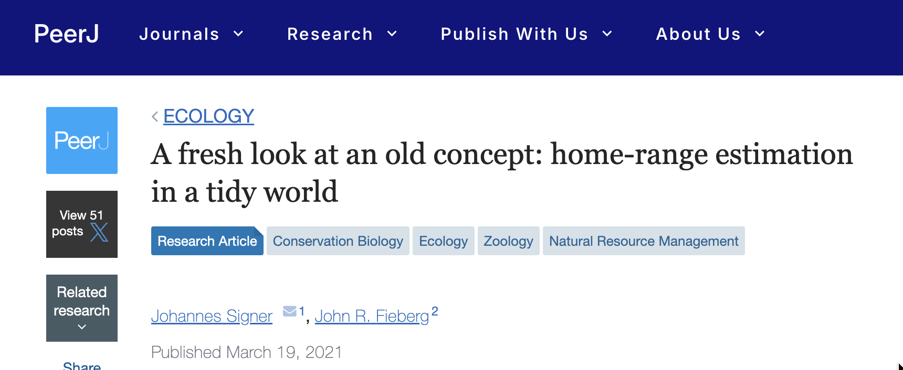
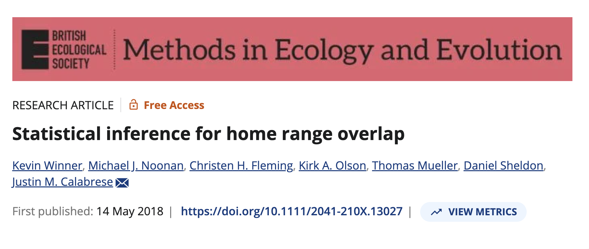

```{r setup}
#| include: false
library(tidyverse)
library(amt)

knitr::opts_knit$set(
  root.dir = here::here("08 Working with HRs/")
)

knitr::opts_chunk$set(
  echo = TRUE,
  warning = FALSE,
  message = FALSE,
  fig.height = 4.5,
  fig.width = 4.5
)
```


## Goals

- Overlaps home ranges
- Efficiently working with many instances
- Exporting home ranges 

::: {.fragment}
Many methods and ideas of this module are described here

{width=70% fig-align="center"}

:::

----

## Two ways to calculate overlaps


:::: {.columns}
::: {.column width="50%"}

### Geometric intersections

- This is a geometric intersection between the isopleths of home ranges. It is the percentage area of one homerange covered by the other home range. 


```{r}
#| echo: false

data(deer)
hr <- deer |> time_of_day()

hr <- hr |> nest(dat = -tod_) |> 
  mutate(dat = map(dat, hr_mcp))

hr_to_sf(hr, dat, tod_) |> 
  ggplot(aes(fill = tod_)) +
  geom_sf(alpha = 0.4) +
  theme_light()
```

:::
::: {.column width="50%" .fragment}

- Note, the order matters, since `hr_overlap(a, b) != hr_overlap(b, a)`. 

Overlap day and night: 

```{r}
#| echo: false
hr_overlap(hr$dat[[1]], hr$dat[[2]])
```

Overlap night and day: 

```{r}
#| echo: false
hr_overlap(hr$dat[[2]], hr$dat[[1]])
```

:::
::::

-------

:::: {.columns}
::: {.column width="50%"}

### Volumne of intersections

- This is the volumne that overlaps of two home ranges.  
- Note, the order **does not** matter, since `hr_overlap(a, b, type = "vi") == hr_overlap(b, a, type = "vi")`. 


```{r}
#| echo: false

data(deer)
hr <- deer |> time_of_day()

tr <- make_trast(deer, res = 20)

hr <- hr |> nest(dat = -tod_) |> 
  mutate(dat = map(dat, hr_kde, trast = tr))

hr_to_sf(hr, dat, tod_) |> 
  ggplot(aes(fill = tod_)) +
  geom_sf(alpha = 0.4) +
  theme_light()
```

:::
::: {.column width="50%" .fragment}

<div style="font-size: 0.8em;">

### Intersection
Overlap day and night: 

```{r}
#| echo: false
hr_overlap(hr$dat[[1]], hr$dat[[2]])
```

Overlap night and day: 

```{r}
#| echo: false
hr_overlap(hr$dat[[2]], hr$dat[[1]])
```

### Volumne of intersection

Overlap day and night: 

```{r}
#| echo: false
hr_overlap(hr$dat[[1]], hr$dat[[2]], type = "vi")
```

Overlap night and day: 

```{r}
#| echo: false
hr_overlap(hr$dat[[2]], hr$dat[[1]], type = "vi")
```
</div>

:::
::::


-------

In `amt` there is the function `hr_overlap()` to calcualte different overlap metrics. These can be specified with the argument `type`:

- `hr` (the default) calcualtes the percentage overlap of the first home range with the second home range.
- `vi` calculates the volumne of intersectino between two UDs. 
- `ba` The Bhattacharyya’s affinity between two UDs.

Both, `vi` and `ba` range from 0 (no overlap at all) to 1 for identical home ranges.

Others metrics are also available, see [Fieberg and Kochanny (2005)](https://doi.org/10.2193/0022-541X(2005)69[1346:QHOTIO]2.0.CO;2) for a more extensive discussion and simulation study. 

-------

In cases where there are multiple instances (e.g., many animals or many home ranges of the same animal), `hr_overlap()` also accepts a list. Then the argument `which` becomes interesting. The following values are possible: 

- `all`: Overlap between all instances are calculated. 
- `consecutive`: Only consecutive home-range overlaps are calculated. 
- `one_to_all`: Home-range overlaps are calculated from the first instance to  all others.

## Overlap with other feature

The function `hr_overlap_feature()` allow to calculate percentage overlaps between a hoem range and other features (from the `sf` package). This could be a park boundary, landuse types or a like. 

-------

In `ctmm` for **aKDE** home-ranges overlaps can in addition be calculated with the confidence intervals. 

{width="70%" fig-align="center"}


# Exporting home ranges

## From home ranges to simple features

There are two ways to export a home range:

1. The function `hr_isopleth()` always returns a `sf`-feature (Polygon). 
2. The function `hr_to_sf()`can take list-column with home range estiamtes and other columns and turn them into a `tibble` with a simple feature (geoemetry) column.


## Writing home ranges

- Any exported home range (that is now in an `sf`) format, can be written to your hard-drive with `sf::st_write()` or used for plotting. 

::: {.fragment}

- Interactively displayed with for example `mapview`. 

:::: {.columns}

::: {.column width="50%"}
```{r}
#| eval: false
data(deer) 
deer |> 
  hr_mcp() |> 
  hr_isopleths() |> 
  mapview::mapview()
```

:::

::: {.column width="50%"}
```{r}
#| echo: false

data(deer) 
deer |> 
  hr_mcp() |> 
  hr_isopleths() |> 
  mapview::mapview()
```

:::

::::


::: 
