```{r setup}
#| include: false
library(tidyverse)
library(amt)

knitr::opts_knit$set(
  root.dir = here::here("10 Outlook/")
)

knitr::opts_chunk$set(
  echo = TRUE,
  warning = FALSE,
  message = FALSE,
  fig.height = 4.5,
  fig.width = 4.5
)
```


# Habitat Selection: Resource/Habitat Selection Analysis (R/HSA)

## What is it about

:::: {.columns}

::: {.column width="50%"}

:::

::: {.column width="50%"}

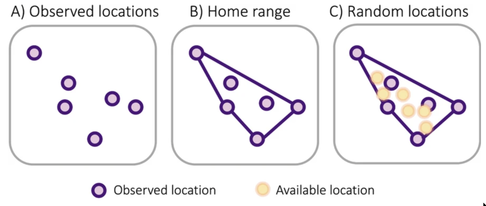
:::

::::

## A typical use case

## What tools do you need

- R alone is sufficient, since you can estimate coefficients using a Generalized Linear Regression with a logit-link function. 
- `amt` can help to create the data. For example, you need to create random points within the availability domain. 
- `amt` can help with calcualting relative selection strength (RSS) a measure to quantify selection. 

## Challenges

- Correct interpretation of the selection coefficients can be challenging. 

# Step Selection Analysis (SSA)

## SSA

- We've talked a lot about movement in this class, using the foundations of random walk models to think about animal movement.
- We just talked about estimating habitat selection from independent samples of space use.
- How do we put together movement and habitat selection?

## SSA

- Step selection analysis uses the movement process to define availability.
- Conceptualize an animal's movement track as a combination of:
  - Selection-free movement kernel
  - Movement-free habitat selection kernel
  
<center>
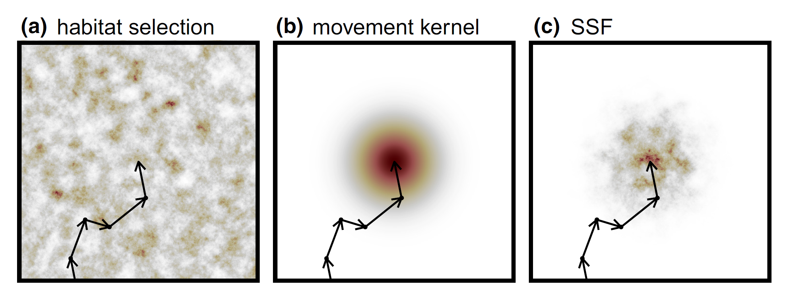{.lightbox}\
</center>

## SSA

- We can use SSA to make **inference** about just habitat selection, while accounting for movement.

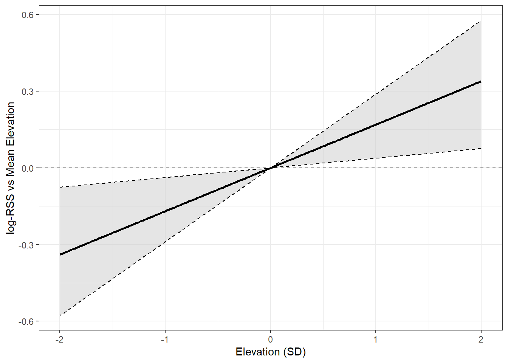{width="70%" .lightbox}

## SSA

- We can use SSA to make **inference** about just movement, while accounting for habitat.

:::: {.columns}

::: {.column}
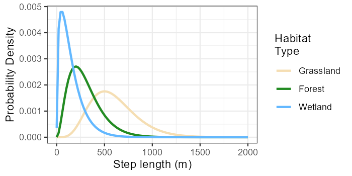
:::

::: {.column}
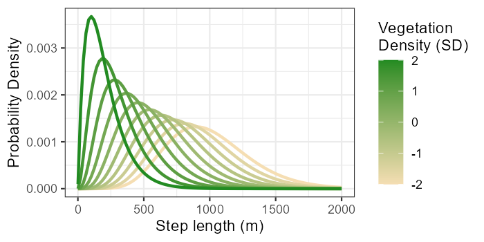
:::

::::

## SSA

- We can use SSA to make **inference** about both movement and habitat selection.

<center>
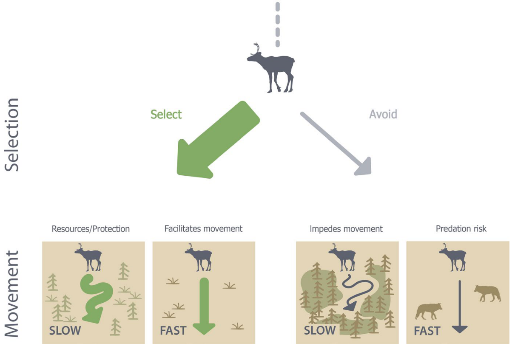{width="50%" .lightbox}
</center>


## SSA

- We can use SSA for **prediction** by simulating from a fitted model.
- A step selection function (SSF) is actually a biased, correlated random walk (BCRW).

<center>
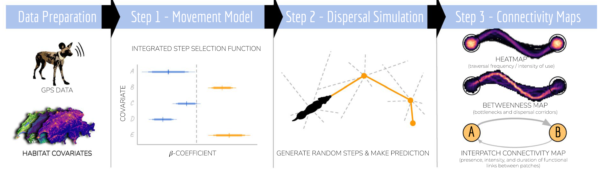{.lightbox}
</center>

## SSA

- We can use SSA for **prediction** by simulating from a fitted model.
- A step selection function (SSF) is actually a biased, correlated random walk (BCRW).

<center>
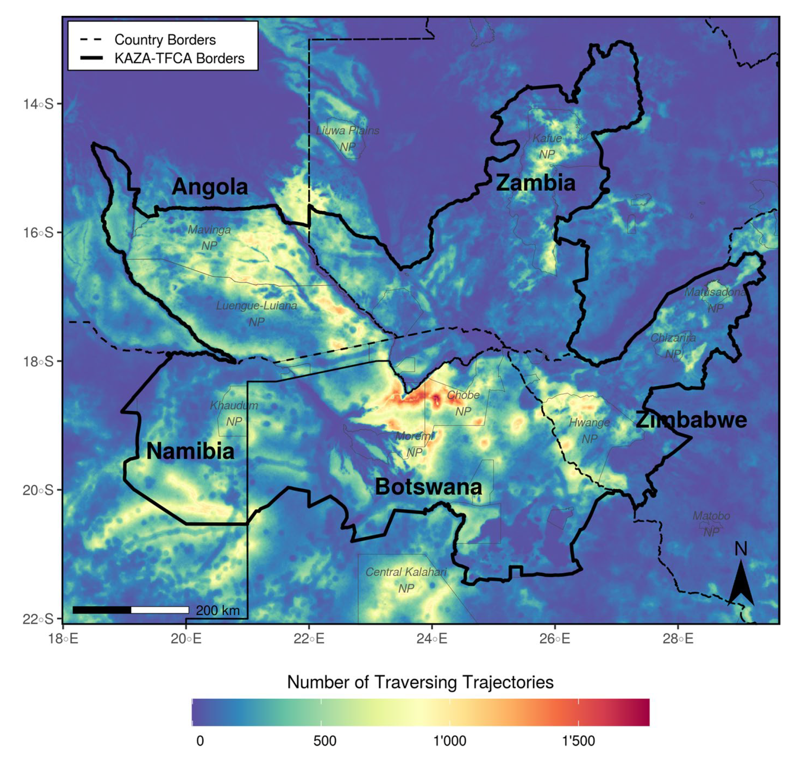{width="40%" .lightbox}
</center>

## SSA

- We can include complex, non-linear terms in SSA for **inference** or **prediction**.

<center>
{width="40%" .lightbox}
</center>

# HMM

## What is it about

:::: {.columns}

::: {.column width="50%"}

:::

::: {.column width="50%"}

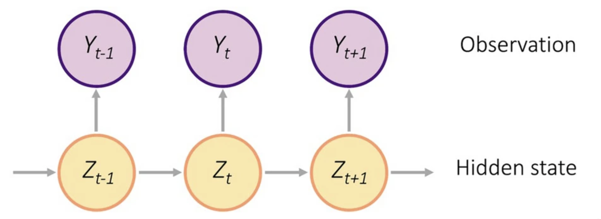

:::

::::

## A typical use case

## What tools do you need

- `moveHMM`, `momentuHMM` and more recently `hmmTMB`. 

# Migration Mapping

## Migration Mapping

- Migration is an ecologically important phenomenon seen across almost all taxa of animals.
- Migration maps are a highly requested resource by managers.
- Migration mapping involves answering these three questions:
  - What is migration?
  - How do we identify migration among other types of behavior?
  - How do we delimit the space around a migration path?
  
## Migration Mapping

:::: {.columns}

::: {.column width="60%"}

- What is migration?
  - Directional movement to take advantage of spatially distributed resources?
  - Back-and-forth movement between two seasonal ranges?
    - To reach different resources and conditions?
    - To maintain the same resources and conditions?
  - Change in movement and habitat selection parameters?

:::


::: {.column width="10%"}

:::

::: {.column width="30%"}

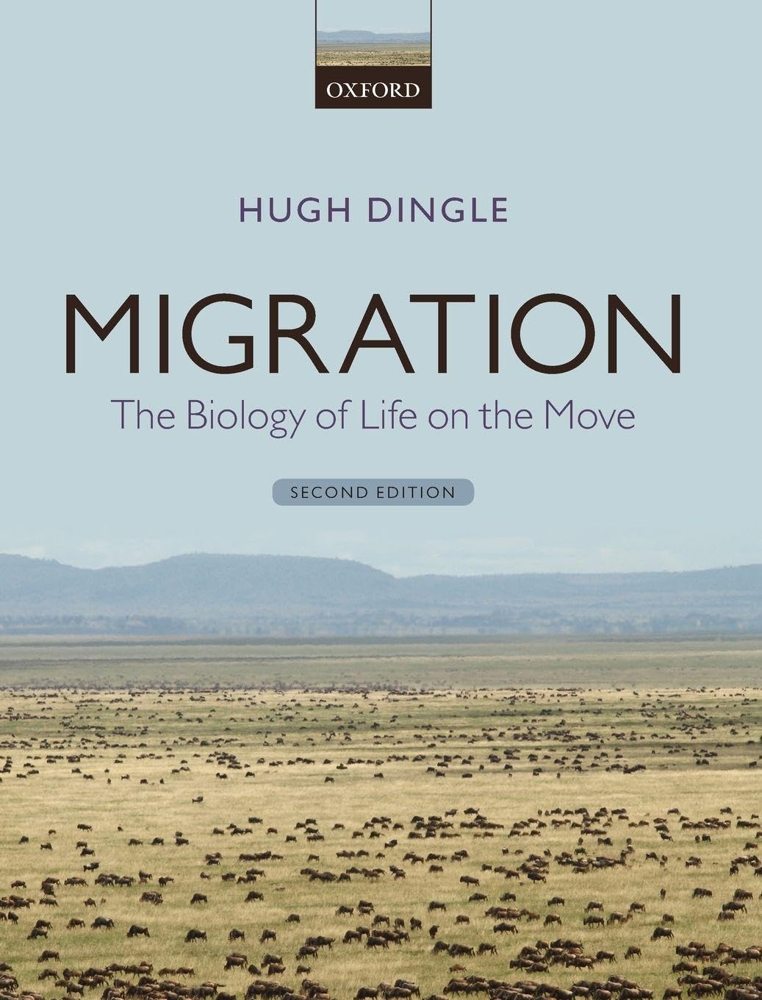{width="100%" .lightbox}\

:::

::::

## Migration Mapping

:::: {.columns}

::: {.column width="60%"}


- What is migration?
</br>


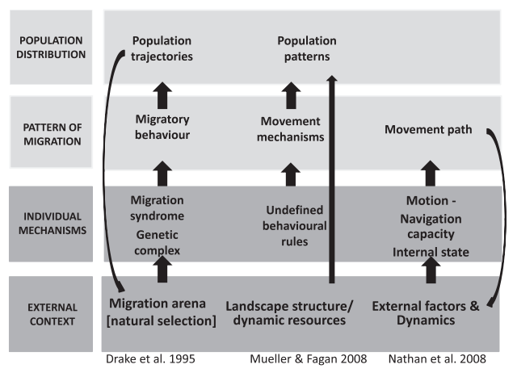{.lightbox}


:::

::: {.column width="40%"}

{.lightbox}\

:::

::::

## Migration Mapping

- How do we identify migration among other types of behavior?

<center>

{.lightbox}\

</center>

## Migration Mapping

- How do we identify migration among other types of behavior?

<center>

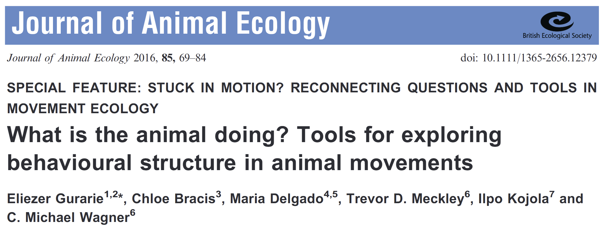\

</center>

## Migration Mapping

- How do we identify migration among other types of behavior?

<center>

\

</center>

## Migration Mapping

- How do we identify migration among other types of behavior?

<center>

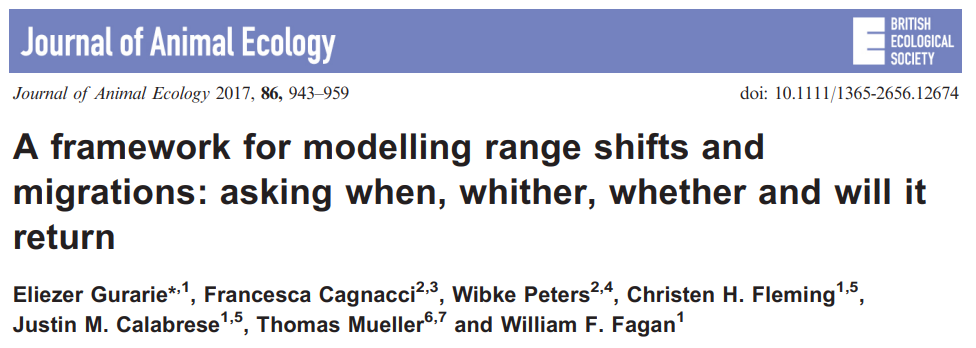\

</center>

## Migration Mapping

- How do we delimit the space around a migration path?

```{r}
#| echo: false
#| fig-align: center
#| fig-width: 7

data.frame(x = c(1, 5, 9),
           y = c(1, 3, 2)) %>% 
  ggplot(aes(x = x, y = y)) +
  geom_line() +
  geom_point(size = 10) +
  coord_equal(ylim = c(0, 4)) +
  theme_minimal() +
  theme(panel.grid = element_blank(),
        axis.text = element_blank(),
        axis.title = element_blank())

```

## Migration Mapping

- How do we delimit the space around a migration path?

```{r}
#| echo: false
#| fig-align: center
#| fig-width: 7

data.frame(x = c(1, 5, 9),
           y = c(1, 3, 2)) %>%
  mutate(max = y + 0.5,
         min = y - 0.5) %>% 
  ggplot(aes(x = x, y = y, ymin = min, ymax = max)) +
  geom_ribbon(fill = "gray") +
  geom_line() +
  geom_point(size = 10) +
  coord_equal(ylim = c(0, 4)) +
  theme_minimal() +
  theme(panel.grid = element_blank(),
        axis.text = element_blank(),
        axis.title = element_blank())

```

## Migration Mapping

- How do we delimit the space around a migration path?

<center>

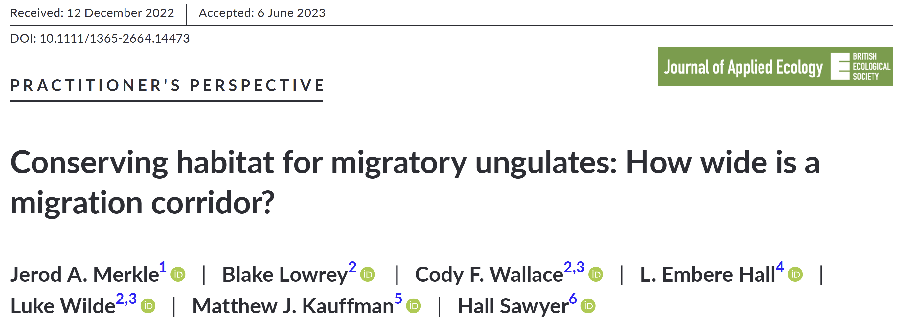\

</center>

## Migration Mapping

- How do we delimit the space around a migration path?

<center>

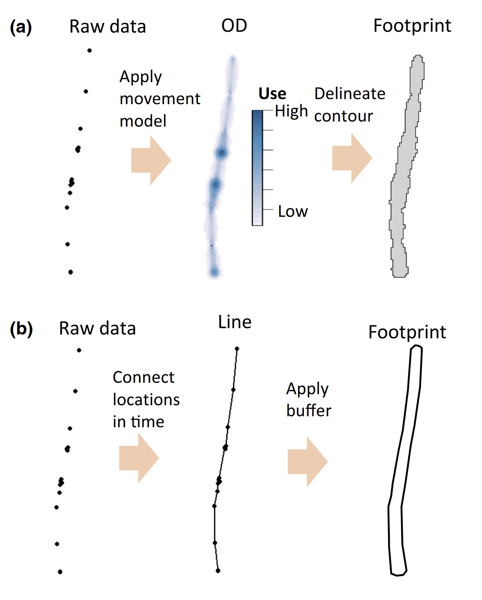{width="40%" .lightbox}

</center>

## Migration Mapping

- How do we delimit the space around a migration path?

<center>

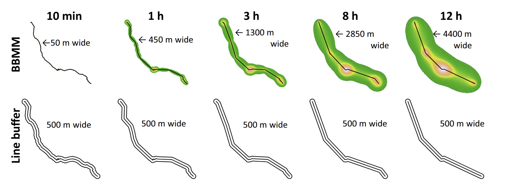{width="80%" .lightbox}

</center>

## Migration Mapping

- How do we delimit the space around a migration path?

<center>

{width="100%" .lightbox}

</center>
